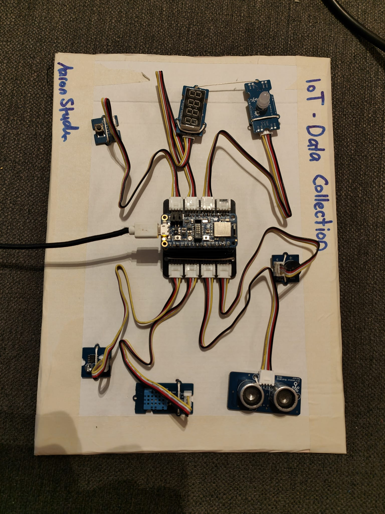
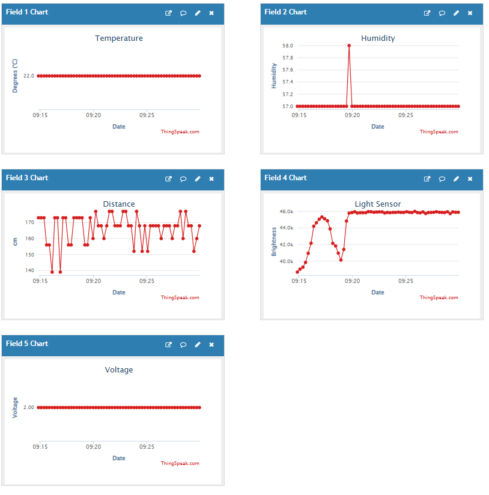

# fhnw-idb-iot-data-collection

Im Rahmen des Moduls "idb - Internet of Things-Datenbeschaffung" an der FHNW habe ich eine Mini-Challenge erarbeitet. Bei dem ich den Fokus auf die Themen des Modules gelegt habt. Dabei geht es im Detail, die Data Acquisition, Transportation und Analysis bei der Arbeit mit Raspberry Pis und Circuitpython kennenzulernen. In dieser Mini-Challenge habe ich diverse Sensoren und Aktuator zusammengearbeitet. Die folgende Hardware wurde benutzt. 

# ThingSpeak Channel
- [ThingSpeak Channel](https://thingspeak.mathworks.com/channels/2753083/private_show)  
Anmeldung auf ThingSpeak erforderlich

# Hardware 

## Adapter

- [Grove Shield for Feather](https://github.com/fhnw-imvs/fhnw-idb/wiki/Grove-Adapters#grove-shield-for-feather)

## Boards

- [Feather nRF52840 Express](https://github.com/fhnw-imvs/fhnw-idb/wiki/Feather-nRF52840-Express)

- [FeatherWing ESP32 Airlift](https://github.com/fhnw-imvs/fhnw-idb/wiki/FeatherWing-ESP32-AirLift)

## Sensors

- [Button](https://github.com/fhnw-imvs/fhnw-idb/wiki/Grove-Sensors#button)

- [Temperature & Humidity Sensor (DHT11)](https://github.com/fhnw-imvs/fhnw-idb/wiki/Grove-Sensors#temperature--humidity-sensor-dht11)

- [Light Sensor v1.2](https://github.com/fhnw-imvs/fhnw-idb/wiki/Grove-Sensors#light-sensor-v12)

- [Ultrasonic Ranger](https://github.com/fhnw-imvs/fhnw-idb/wiki/Grove-Sensors#ultrasonic-ranger)

## Actuators

- [Chainable RGB LED](https://github.com/fhnw-imvs/fhnw-idb/wiki/Grove-Actuators#chainable-rgb-led)

- [4-Digit Display (TM1637)](https://github.com/fhnw-imvs/fhnw-idb/wiki/Grove-Actuators#4-digit-display-tm1637)

- [Buzzer](https://github.com/fhnw-imvs/fhnw-idb/wiki/Grove-Actuators#buzzer)

# Links

- [Wiki](https://github.com/fhnw-imvs/fhnw-idb/wiki)

- [Acquisition](https://github.com/fhnw-imvs/fhnw-idb/tree/master/data-acquisition/CircuitPython)

- [Transport](https://github.com/fhnw-imvs/fhnw-idb/tree/master/data-transport/CircuitPython)

- [Analysis](https://github.com/fhnw-imvs/fhnw-idb/tree/master/data-analysis)

# Transport